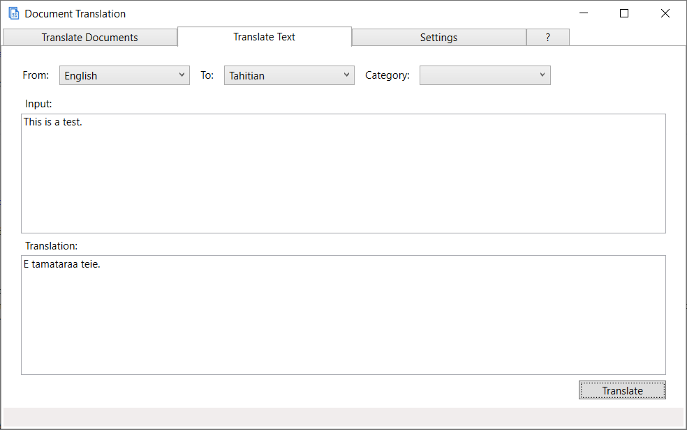

# Microsoft Document Translation

Translate local files or network files in many different formats, to more than 90 different languages.
Supported formats include HTML, PDF, all Office document formats, Markdown and plain text. 
The complete [list of document formats is here](https://docs.microsoft.com/azure/cognitive-services/translator/document-translation/overview#supported-document-formats).

You can select up to 1000 files and translate them to a different language with a single command.
The Windows UI gives you options to comfortably select source files, target language, and the folder you want to deposit the translations in.
It comes with a command line utility that does the same thing using a command line interface. 
Document Translation uses the Azure Translator Service to perform the translations. You need a subscription to Azure, and register
a Translator resource as well as a storage resource. [The documentation](https://microsofttranslator.github.io/DocumentTranslation) gives detailed instructions on how to obtain those. 

For the translation you can specifiy a glossary (custom distionary) to use. You can also make use of a custom translation system
you may have built with [Custom Translator](http://customtranslator.ai).

**Main UI**

A simple copy-and-paste text translation interface is present in the Windows UI. 

**Text Translation UI**

## Documentation

See the [complete documentation of the tool](https://microsofttranslator.github.io/DocumentTranslation).

The documentation is stored in the /docs folder of the project. 

## Implementation

Document Translation is written and compiled for .Net 5. The command line utility should be compatible with other platforms
running .Net 5, namely MacOS and Linux. Tested only on Windows 10 at this point. Please let us know via an issue if you find problems with
other platforms running .Net 5. 

## Issues

Please submit an issue for questions or comments, and of course for any bug or problem you encouter.

## Contributions
Please contribute your bug fix and functionality additions. Submit a pull request. We will review and integrate
quickly - or reject with comments.

## Future plans

- Migrating the settings to Azure Key Vault.
- Option to extend the set of file formats with format conversions that are processed locally, as a library within this tool.

## Credits
The tool uses following Nuget packages:
- Nate McMaster's Command Line Utilities for the CLI command and options processing. 
- Azure.Storage.Blobs for the interaction with the Azure storage service. 
