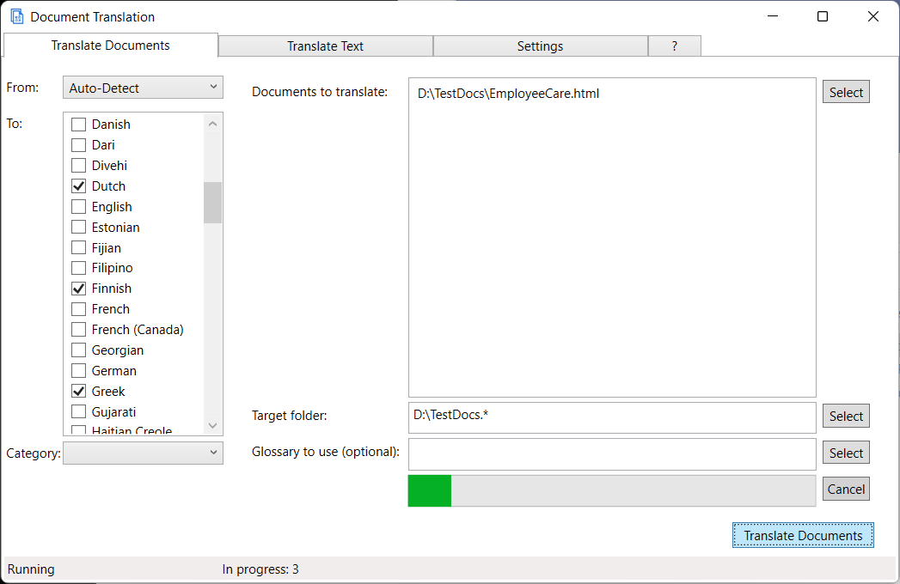

# Microsoft Document Translation
The Document Translation tool translates documents in your local storage using the Microsoft Azure Translator service. 
It can translate Office documents (Word, Excel, PowerPoint), HTML documents, PDF documents, Outlook Messages, Markdown, MHTML,
plain text, RTF and XLIFF files.

It comes in a Windows UI and a command line interface. It is built on .Net 5. The command line interface runs on Linux, MacOS and Windows. 

-------------------
## Content

[Running on Windows](#running-on-Windows)

[Command Line Interface](#command-line-interface)

[Implementation Details](#implementation-details)

[Bug Reports](#bug-reports)

[Contributions](#contributions)

[Credits](#credits)

---------------

## Running on Windows

### Install
Run the latest **DocumentTranslation.Setup.msi** from [Github releases](https://github.com/MicrosoftTranslator/DocumentTranslation/releases).
It will install the document translation tool on your Windows computer.

### Minimum requirements
- An Azure subscription
- A Translator resource in your Azure subscription
- A Blob storage resource in your Azure subscription
- An Windows 10 or later operating system able to run .Net 5. If it fails, install .Net 5 from https://dotnet.microsoft.com/download/dotnet/5.0.

#### How to obtain the service credentials

##### Translator resource key and name

You can use an existing Azure Translator resource that you have. 
If you don't have a Translator resource, create one:

------------------------------

------------------------------
Visit the properties of your Translator resource.

-------------------

-------------------
Copy the key to the "Subscription Key" field in the Settings/Authentication tab.

Copy the name of the resource into the "Resource Name" field in the Settings/Authentication tab.

Select the Azure region where your Translator resource is located in the Settings/Authentication tab.

##### Storage connection string
You can use an existing Azure storage account that you have. 
If you don't have an Azure storage account, create one:

------------------------

-------------------------

Visit the properties of your storage account.
Copy the entire "Connection String". It is a very long string. 

------------------

--------------

Paste this string to the "Storage Connection String" field in the Settings/Authentication tab.

### Translate Documents

After you have entered the credentials, you are able to start translating documents.

Select your source and target languages. You may choose "Auto-Detect" as the source language.
Leave Category empty, unless your administrator or your langauge service provider has told you to use a certain category,
or you have defined your own custom category with [Custom Translator](http://customtranslator.ai).

Choose your local documents that you want to translate. Pressing "Select" opens a file picker interface. You may pick as many files
to translate as you like, up to 1000.
Additional limits are documented in [API documentation: Limits](https://docs.microsoft.com/azure/cognitive-services/translator/document-translation/get-started-with-document-translation?tabs=csharp#content-limits)

Choose a folder to store the translated documents in. You may choose any folder on your computer.
If you have translated to this langauge before, the app will suggest using the same folder as last time you translated to this target language.

You may optionally provide a glossary of words or phrases you want to have translated in a specific way. Add only words and phrases that you are sure must
be translated a certain way, and only those that do not translate naturally as intended. Works well for compound nouns like product names or
phrases that shall remain untranslated.

You can supply a simple mapping file like this, as a TSV (tab separated variables) file:

After selecting the languages, one or more documents to translate, and the target location, you are ready to hit "Translate Documents".

The status bar at the bottom gives an indication of the status of the translation, and whether an error was encountered.

After the progress bar reaches 100%, you can retrieve your documents in the target location.

You are now ready for the next language or the next batch of documents to translate. 

-----------------------
## Command Line Interface
The Microsoft Document Translation Command Line Interface gives quick access to document translation functions.
It is a simple program which makes use of the server-side document translation functionality, giving it a client-based
command line interface, allowing you to translate local documents, in any of the the supported file formats. Use `doctr formats`
to list the [available formats](https://docs.microsoft.com/azure/cognitive-services/translator/document-translation/overview#supported-document-formats).
The CLI tool is designed to be used in document workflow automation and in batch processing scripts.

### Download
Please download the latest binary from the "Releases" section and extract the content of the zip file to a folder of your choice,
recommended is a folder in your operating system's PATH.

### Minimum requirements
- An Azure subscription
- A Translator resource in your Azure subscription
- A Blob storage resource in your Azure subscription
- An Linux, MacOS or Windows operating system able to run .Net 5. The tool is written in .Net 5.0 and able to run on other platforms that
.Net 5.0 is present on. Tested only on Windows. Try to run as is. If it fails,
install .Net 5 from https://dotnet.microsoft.com/download/dotnet/5.0.

#### How to obtain the service credentials

##### Translator resource key and name

You can use an existing Translator resource that you have. 
If you don't have a Translator resource, create one:

------------------------------

------------------------------
Visit the properties of your Translator resource.

-------------------

-------------------

Copy the key and paste it into the "key" credential. It doesn't matter whether you use key 1 or key 2.
Use `doctr config set --key=<this key>` to enter.

Copy the resource name, in the example "TranslatorText", and paste it into the "name" credential.
Use `doctr config set --name=<this name>` to enter.

##### Storage connection string
You can use an existing Azure storage account that you have. 
If you don't have an Azure storage account, create one:

------------------------

-------------------------

Visit the properties of your storage account.
Copy the entire "Connection String". It is a very long string. 

------------------

--------------

Paste this string to the "Storage connection string" credential.
Use `doctr config set --storage="<this string>"` to enter, with the quotes.

### Usage
Use `doctr --help` or `doctr <command> --help` to get detailed information about the command.

#### Configure the tool
The configuration contains the credentials for the needed Azure resources:
The minimum needed credentials are
- The subscription key to the Translator resource.
- The name of the Translator resource 
- A storage connection string.
You can obtain all of these from the Azure portal.

Command	| Required/Optional
----------------------------|-----------------------------------------
`doctr config --set storage <Storage Connection String>`	| Required	|
`doctr config --set key <Subscription key of the Translator resource>`	| Required	|
`doctr config --set name <Name of the Azure Translator resource>`	| Required	|
`doctr config --set category <Custom Translator category ID>`	| Optional	|

The configuration settings are stored in the file appsettings.json, in the user's roaming app settings folder, typically 
C:\Users\<Username>\AppData\Roaming\Document Translation
You may edit the file by hand, using the editor of your choice. 

You can inspect the settings using the following commands:

Command	| Function
----------------------------|-----------------------------------------
`doctr config list`	| List the current configuration settings.
`doctr config test`	| Validate the credentials and report which one is failing.

#### List capabilities

 Command	| Function
-------------------|---------------------
`doctr languages`	| List the available languages. Can be listed before credentials are set.
`doctr formats`		| List the file formats available for translation. Requires credentials key, name and storage to be set.
`doctr glossary`		| List the glossary formats available for use as glossary. Requires credentials key, name and storage to be set.

#### Translate

Command	| Function
--------|----------
`doctr translate <source folder OR document> [<target folder>] --to <language code>` | Translate a document or the content of a folder to another language.

If provided, the target folder must be a folder, even if the source document is an individual document. If not provided, the translated document will be placed in a folder
that has the same name as the source folder, plus `.<language code>`.

Optional parameters to the translate command | Function
---------------------------------------------|----------
`--from <language code>` | The language to translate from. If omitted, the system performs automatic language detection.
`--key <key to the Translator resource>` | This key will override the setting in the appsettings.json file. Use this if you want to avoid storing the key in a settings file. 
`--category <category ID>` | The custom Translator category ID.
`--glossary <file or folder>` | The glossaries to use for this run. The glossary contains phrases with a defined translation in a table format.

#### Clear
If a translation run gets interrupted or fails, it may also fail to clean up after itself and leave behind documents in the storage account.
A repeated run will always use a fresh storage container for its operation. The 'clear' command deletes storage containers from failed or abandoned runs
for all DOCTR runs that are using the storage account you provided in the settings. In order to not disrupt any other runs of the service,
it limits the deletion to containers that are older than one week. 

Command	| Function
--------|---------
`doctr clear`	| Delete residue from abandoned or failed translation runs in the storage account

## Implementation Details
Written in C#, based on .Net 5. 
This tool makes use of the Azure Document Translation service. The Azure Document Translation translates a set of documents that reside in an Azure storage container,
and delivers the translations in another Azure storage container. This tool provides a local interface to that service, allowing you to translate a locally
rediding file or a folder, and receiving the translation of these documents in a local folder. The tool uploads the local documents, invokes the translation,
monitors the translation progress, downloads the translated documents to your local machine, and then deletes the containers from the service.
Each run is independent of each other by giving the containers it uses a unique name within the common storage account.

Project "doctr" contains the command line processing based on Nate McMaster's Command Line Utilities. All user interaction is handled here.
Project 'DocumentTranslationService' contains three relevant classes: DocumentTranslationService handles all the interaction with the Azure service. 
DocumentTranslationBusiness handles the local file operations and business logic. Class 'Glossary' handles the upload of the glossary, when a glossary is specified.

Future optimization includes a shared storage for the glossary, so that multiple clients can refer to a single company-wide glossary. 

## Bug Reports
Please report any bugs por issues you find with the tool [here](https://github.com/MicrosoftTranslator/DocumentTranslation/issues).

## Contributions
Please contribute your bug fix, and functionality additions. Submit a pull request. We will review and integrate
quickly - or reject with comments.

## Credits
The tool uses following Nuget packages:
- Nate McMaster's Command Line Utilities for the CLI command and options processing. 
- Azure.Storage.Blobs for the interaction with the Azure storage service. 
