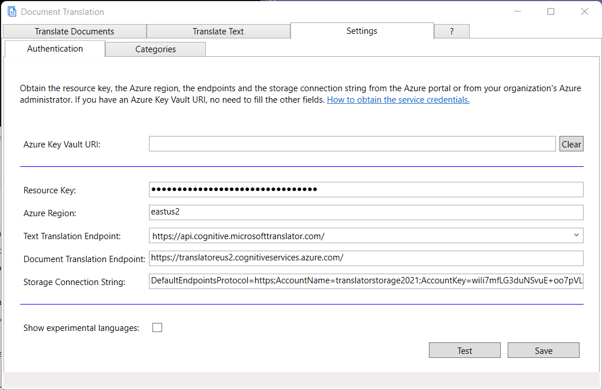
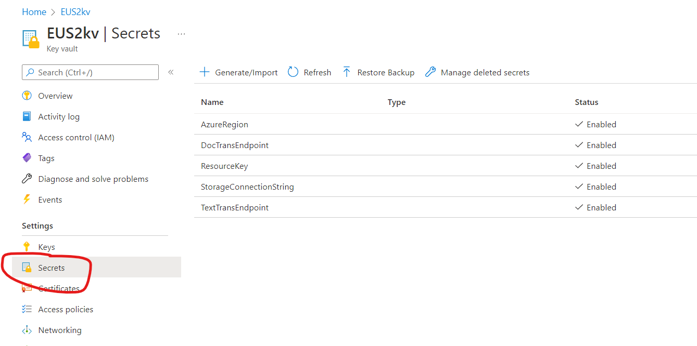

The Document Translation tool translates documents in your local storage using the Microsoft Azure Translator service. 
It can translate Office documents (Word, Excel, PowerPoint), HTML documents, PDF documents, Outlook Messages, Markdown, MHTML,
plain text, RTF and XLIFF files.

It comes in a Windows UI and a command line interface. The command line interface runs MacOS and Windows, or any system
that a [.Net 6 runtime](https://dotnet.microsoft.com/download/dotnet/6.0) is available for. Tested only on Windows and Mac.

-------------------
## Content

[Running on Windows](#running-on-Windows)

[Command Line Interface](#command-line-interface)

[Running on Mac OS X](#running-on-mac-os-x)

---------------

## Running on Windows

### Install
Run the latest **DocumentTranslation.Setup.msi** from [Github releases](https://github.com/MicrosoftTranslator/DocumentTranslation/releases).
It will install the document translation tool on your Windows computer.

### Minimum requirements
- An Azure subscription
- A Translator resource with a pricing tier of S1 or higher
- A Blob storage resource in your Azure subscription
- A Windows 10 or later operating system able to run .Net 6.
If installation fails, install .Net 6 manually from https://dotnet.microsoft.com/download/dotnet/6.0.

#### How to obtain the service credentials

If you prefer to not maintain the acess secrets on your computer, or if your organization manages the
Azure account for you, you may use Azure Key Vault to manage the credentials.

##### Azure Key Vault

If your organization manages the Azure subscription for you, ask your Azure administrator for the name of
the Azure Key Vault. Enter the URI of the Azure Key Vault in the Settings page.
You don't have to enter any other settings in this case.
If you are an Azure administrator, see [here](#azure-key-vault-administration) how to set up Azure Key Vault.

If a Key Vault URI is specified, your browser will open and ask you to log in.
If a Key Vault URI is specified, the other entries on this Settings page have no effect.

##### Translator resource key and endpoints

You can use an existing paid Azure Translator resource. Document translation will not work with a free Translator resource.
If you don't have a Translator resource, create one:

------------------------------

Make sure you pick a pricing tier of S1 or higher. 

Visit the properties of your Translator resource.

-------------------

-------------------
Copy the Key to the "Resource Key" field in the Settings/Authentication tab.

Copy the Text Translation endpoint to the "Text Translation Endpoint" field in the Settings/Authentication tab.

Copy the Document Translation endpoint into the "Document Translation" field in the Settings/Authentication tab.

Enter the "Azure Region" where your Translator resource is located in the Settings/Authentication tab. 

##### Virtual Network/Private Endpoint

When using a virtual network or private endpoint, copy the Text Translation endpoint and Document Translation endpoint
from the "Virtual Network" tab of the "Keys and Endpoint" section of the Translator resource.

Copy this endpoint into the Document Translation app's Settings page and add
`translator/text/v3.0`
to the end of the Text Translation Endpoint URL.

The same modification to the Text Translation URL entered into Key Vault is necessary when using Key Vault
to manage the credentials with Private Endpoints. 

##### Storage connection string
You can use an existing Azure storage account. 
If you don't have an Azure storage account, create one:

------------------------

-------------------------

Visit the properties of your storage account.
Copy the entire "Connection String". It is a very long string. 

------------------

--------------

Paste this string to the "Storage Connection String" field in the Settings/Authentication tab.

##### Azure Key Vault administration

Ignore this section if you are entering the secrets into the Settings page directly. 

To create a Key Vault for use with Document Translation:
- Set up resources for Translator and for Storage as described above
- Create an Azure Key Vault resource
- Create Secrets for each of 
    - AzureRegion
    - DocTransEndpoint
    - ResourceKey
    - StorageConnectionString
    - TextTransEndpoint

and copy the **secret from the Translator** resource and the **connection string from the Storage** resource.

The names of the secrets must be exactly like this (casing is significant),
and the Key Vault resource should look like this:

In the Access control (IAM) section add the users to the **Key Vault Secrets User** role assignment.

Provide the users with the **URI** of the Key Vault. In the example the URI is "https://eus2kv.vault.azure.net/". 

### Translate Documents

After you have entered the credentials, you are able to start translating documents.

Select your source and target languages. You may choose "Auto-Detect" as the source language.
Leave Category empty, unless your administrator or your language service provider has told you to use a certain category,
or you have defined your own custom category with [Custom Translator](http://customtranslator.ai).

Choose your local documents that you want to translate. Pressing "Select" opens a file picker interface. You may pick as many files
to translate as you like, up to 1000.
Additional limits are documented in [API documentation: Limits](https://docs.microsoft.com/azure/cognitive-services/translator/document-translation/get-started-with-document-translation?tabs=csharp#content-limits)

Choose a folder to store the translated documents in. You may choose any folder on your computer,
or any network folder that you have create and write permissions to.
If you are translating to a single language and have translated to this language before,
the app will suggest using the same folder as last time you translated to this target language.
For the target folder you may enter a '*' where you want the app to place the language code of the target language.
A table of the language codes with their friendly names is in the Languages tab of the help section ('?').

You may optionally provide a glossary of words or phrases you want to have translated in a specific way. Add only words and phrases that you are sure must
be translated a certain way, and only those that do not translate naturally as intended. This works best for compound nouns like product names or
phrases that shall remain untranslated.

You can supply a simple mapping file like this, as a TSV (tab separated variables) file:

After selecting the languages, one or more documents to translate, and the target location, you are ready to hit "Translate Documents".

The status bar at the bottom gives an indication of the status of the translation, and whether an error was encountered.

After the progress bar reaches 100%, you can retrieve your documents in the target location.

-----------------------
## Command Line Interface
The Microsoft Document Translation Command Line Interface gives quick access to document translation functions.
It is a simple program which makes use of the server-side document translation functionality, giving it a client-based
command line interface, allowing you to translate local documents, in any of the the supported file formats. Use `doctr formats`
to list the [available formats](https://docs.microsoft.com/azure/cognitive-services/translator/document-translation/overview#supported-document-formats).
The CLI tool is designed to be used in document workflow automation and in batch processing scripts.

### Download
Please download the latest binary from the "Releases" section and extract the content of the zip file to a folder of your choice,
recommended is a folder in your operating system's PATH.

### Minimum requirements
- An Azure subscription
- A Translator resource in your Azure subscription
- A Blob storage resource in your Azure subscription
- An Linux, MacOS or Windows operating system able to run .Net 6. The tool is written in .Net 6.0 and able to run on other platforms
that .Net 6.0 is present on. Tested only on Windows and MacOS. Try to run as is. If it fails,
install .Net 6 from https://dotnet.microsoft.com/download/dotnet/6.0.

#### How to obtain the service credentials

##### Translator resource key and name

You can use an existing Translator resource that you have. 
If you don't have a Translator resource, create one:

------------------------------

------------------------------
Visit the properties of your Translator resource.

-------------------

-------------------

Copy the key and paste it into the "key" credential. It doesn't matter whether you use key 1 or key 2.
Use `doctr config set --key=<this key>` to enter.

Copy the resource name, in the example "TranslatorText", and paste it into the "name" credential.
Use `doctr config set --name=<this name>` to enter.

##### Storage connection string
You can use an existing Azure storage account that you have. 
If you don't have an Azure storage account, create one:

------------------------

-------------------------

Visit the properties of your storage account.
Copy the entire "Connection String". It is a very long string. 

------------------

--------------

Paste this string to the "Storage connection string" credential.
Use `doctr config set --storage="<this string>"` to enter, with the quotes.

### Usage
Use `doctr --help` or `doctr <command> --help` to get detailed information about the command.
On a Mac, use `dotnet doctr.dll --help` or `dotnet doctr.dll <command> --help` to get detailed information about the command.

#### Configure the tool
The configuration contains the credentials for the needed Azure resources:
The minimum needed credentials are
- The resource key to the Translator resource.
- The name of the Translator resource 
- A storage connection string.
You can obtain all of these from the Azure portal.

Command	| Required/Optional
----------------------------|-----------------------------------------
`doctr config --set storage <Storage Connection String>`	| Required	|
`doctr config --set key <Resource Key of the Translator resource>`	| Required	|
`doctr config --set name <Name of the Azure Translator resource>`	| Required	|
`doctr config --set category <Custom Translator category ID>`	| Optional	|

The configuration settings are stored in the file appsettings.json, in the user's roaming app settings folder, typically 
C:\Users\<Username>\AppData\Roaming\Document Translation
You may edit the file by hand, using a text editor of your choice. 

You can inspect the settings using the following commands:

Command	| Function
----------------------------|-----------------------------------------
`doctr config list`	| List the current configuration settings.
`doctr config test`	| Validate the credentials and report which one is failing.

The test function will always fail with an invalid key message if the Azure key is from a region other than "global".
Document translation will still work, just this test is failing. 

#### List capabilities

 Command	| Function
-------------------|---------------------
`doctr languages`	| List the available languages. Can be listed before credentials are set.
`doctr formats`		| List the file formats available for translation. Requires credentials key, name and storage to be set.
`doctr glossary`		| List the glossary formats available for use as glossary. Requires credentials key, name and storage to be set.

#### Translate

Command	| Function
--------|----------
`doctr translate <source folder OR document> [<target folder>] --to <language code>` | Translate a document or the content of a folder to another language.

If provided, the target folder must be a folder, even if the source document is an individual document. If not provided, the translated document will be placed in a folder
that has the same name as the source folder, plus `.<language code>`.

Optional parameters to the translate command | Function
---------------------------------------------|----------
`--from <language code>` | The language to translate from. If omitted, the system performs automatic language detection.
`--key <key to the Translator resource>` | This key will override the setting in the appsettings.json file. Use this if you want to avoid storing the key in a settings file. 
`--category <category ID>` | The custom Translator category ID.
`--glossary <file or folder>` | The glossaries to use for this run. The glossary contains phrases with a defined translation in a table format.

#### Clear
If a translation run gets interrupted or fails, it may also fail to clean up after itself and leave behind documents in the storage account.
A repeated run will always use a fresh storage container for its operation. The 'clear' command deletes storage containers from failed or abandoned runs
for all DOCTR runs that are using the storage account you provided in the settings. In order to not disrupt any other runs of the service,
it limits the deletion to containers that are older than one week. 

Command	| Function
--------|---------
`doctr clear`	| Delete residue from abandoned or failed translation runs in the storage account

----------------------------

## Running on Mac OS X

At this point point only the command line version runs on the Mac. The GUI version is waiting for .Net 6 MAUI to be released.

### Download and install

- Install .Net 6 runtime for Mac from https://dotnet.microsoft.com/. You do not need the SDK, just the runtime.
Download and install the .Net 6 runtim for the appropriate processor platform of your Mac.

- Download the zip file in the releases folder and expand to a suitable directory on the Mac HD.

### Command line syntax notes

The command line syntax is the same as listed [above](#command-line-interface), but instead of `doctr <command>` you run `dotnet doctr.dll <command>`.

When pasting the storage connection string in `dotnet doctr.dll config set --storage "<storageconnectionstring>"` please make sure you use
quotes around the connection string, otherwise the string will be cut off prematurely.

